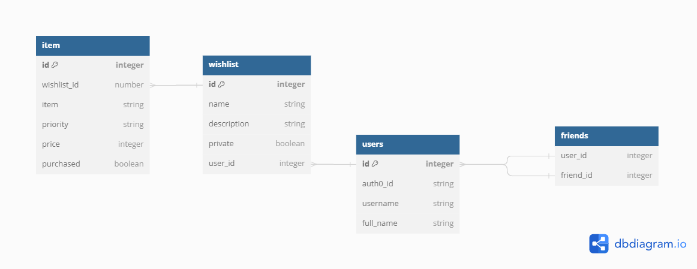

# Wish Connect

## Getting Started 

This repository uses [TailwindCSS](https://tailwindcss.com/) for styling. For the best developer experience, install the [TailwindCSS IntelliSense](https://marketplace.visualstudio.com/items?itemName=bradlc.vscode-tailwindcss) extension for VSCode. Optionally, if you prefer, you may choose to use CSS Modules for a more traditional CSS experience.

### Frontend:

- [React](https://react.dev/)
- [TailwindCSS](https://tailwindcss.com/)
- [CSS Modules](https://github.com/css-modules/css-modules)
- [React Router](https://reactrouter.com/)
- [Vite](https://vitejs.dev/)
- [React Query](https://tanstack.com/query/latest/docs/react/overview)

### Backend:

- [Express](https://expressjs.com/)
- [Knex](http://knexjs.org/)
- [SQLite3](https://www.sqlite.org/index.html)

### Testing:

- [React Testing Library](https://testing-library.com/docs/react-testing-library/intro/)
- [Vitest](https://vitest.dev/)
- [nock](https://github.com/nock/nock)
- [supertest](https://github.com/visionmedia/supertest)

## Contributing Guide 

To run this project:

```sh
# clone to your local machine
cd wish-connect
npm install
cp .env.example .env # fill in the values
                     # check Discord for the values

npm run db:reset # to run migrations and seeds

# then
npm run dev

# or
# to run the React client (Vite)
npm run dev:client
# will run the React client on http://localhost:5173

# to run the API server (Express)
npm run dev:server
# will run the API server on http://localhost:3000
```

## About the Project 

### DB Schema (for now)



<details>
<summary>ERD code</summary>

```ts

Table wishlist {
  id integer [primary key]
  name string
  description string
  private boolean
  user_id integer
}

Table item {
  id integer [primary key]
  wishlist_id number
  item string
  priority string
  price integer
  purchased boolean
}


Table users {
  id integer [primary key]
  auth0_id string
  username string
  full_name string
}

Table friends {
  user_id integer
  friend_id integer
}


Ref: "item"."wishlist_id" > "wishlist"."id"

Ref: "wishlist"."user_id" > "users"."id"

Ref: "friends"."user_id" < "users"."id"

Ref: "friends"."friend_id" < "users"."id"
```

</details>

---

### Wireframes

Wireframes live on the Miro Board, check Discord for the link!

---


## Snippets 

These are small snippets of code that may help you out. Note that this is not an exhaustive list, and you may need to mix and match concepts.

#### Fetch from Component

<details>
  <summary>Code:</summary>

```ts
// component.tsx
const { data: fruits, isLoading, isError } = useQuery(['fruits'], getFruits)

if (isError) {
  return (/* ... */)
}

if (isLoading) {
  return (/* ... */)
}

return (/* ... */)
```

</details>

#### Fetch with Authentication

<details>
  <summary>Code:</summary>

```ts
// component.tsx
const { getAccessTokenSilently } = useAuth0()

const { data: fruits, isLoading, isError } = useQuery(['fruits'], async () => {
  const token = await getAccessTokenSilently()
  return getForbiddenFruits({ token })
})

if (isError) {
  return (/* ... */)
}

if (isLoading) {
  return (/* ... */)
}

return (/* ... */)
```

</details>

---

### API Client

#### Set Authorization Header for API Requests

<details>
  <summary>Code:</summary>

```ts
// apis/fruits.ts
async function getForbiddenFruits({ token }: { token: string }) {
  const response = await request
    .get('/api/v1/fruits')
    .set('Authorization', `Bearer ${token}`)

  return response.body.fruits
}
```

</details>

### Express Routes

#### Checking for Authentication (server-side)

<details>
  <summary>Code:</summary>

```ts
// server/routes/fruits.ts
router.get('/', checkJwt, (req, res) => {
  // req.auth is available here
  const userId = req.auth?.payload.sub

  try {
    const fruits = await db.getForbiddenFruits(userId)

    // ...
  } catch (error) {
    // ...
  }
})
```

</details>

---

### Database/Knex

#### Database Join

<details>
  <summary>Code:</summary>

```ts
// server/db/fuctions/reviews.ts
async function getFruits(): Promise<FruitWithReview[]> {
  //         table 1
  return (
    db('reviews')
      //     table 2   column 1           column 2
      .join('fruits', 'reviews.fruitId', 'fruits.id')
      .select(
        // make sure column names end up being unique
        'fruits.id',
        'fruits.name',
        'fruits.color',
        'fruits.taste',
        'reviews.tasteRating',
        'reviews.textureRating',
        'reviews.content'
      )
  )
}
```

</details>